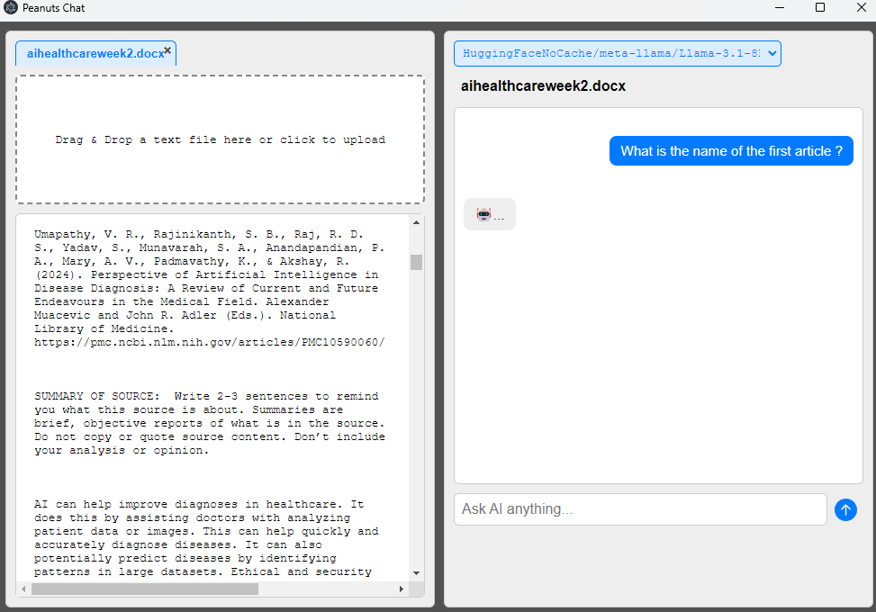
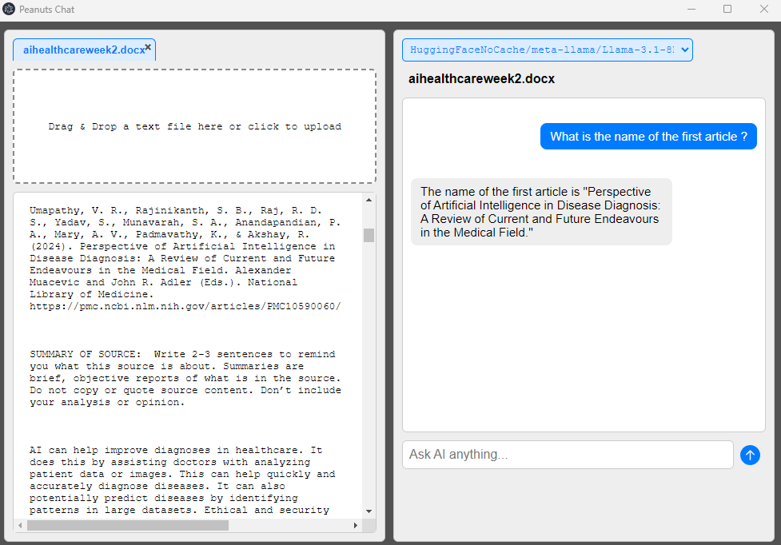

# UnRead Chatbot

<table>
  <tr>
    <td></td>
    <td></td>
  </tr>
</table>

### A simple, multi-model chatbot running on local LLMs through Langchain and Hugging Face with a beautiful Electron frontend.  


#### Previews, searches, and answers complex questions about documents. Supports many SoTA edge models running locally. Has optimizations to kvcache.

---

### 1. Requirements

This project requires Python 3.9+ and Node.js/npm.

- **Frontend:** `Node.js`
- **Backend:** `flask`, `torch`, `transformers`, `langchain`, and other packages listed in `python/requirements.txt`.

---

### 2. Setup & Installation

**A. Frontend Dependencies**
Navigate to the project's root directory and run:
```bash
npm install
```
**B. Backend Dependencies**

Navigate to the project's root directory and run:
```bash
pip install -r python/requirements.txt
```

**C. Hugging Face Authentication**

To use gated models like Llama 3.1, run this command and enter your Hugging Face access token:
```bash
huggingface-cli login
```

---

### 3. Running the Application

**A. Frontend**
```bash
npm start or npm electron .
```
**B. Backend**

Start the Flask server from the project's **root directory**:
```bash
python python/http_api.py
```
The server will start on `http://127.0.0.1:5000`.

---

### 4. Project Documentation

For detailed documentation on the frontend, backend, and API, please see the `docs.md` file inside the `docs/` folder.

[**View Full Documentation (docs/docs.md)**](./docs/docs.md)
